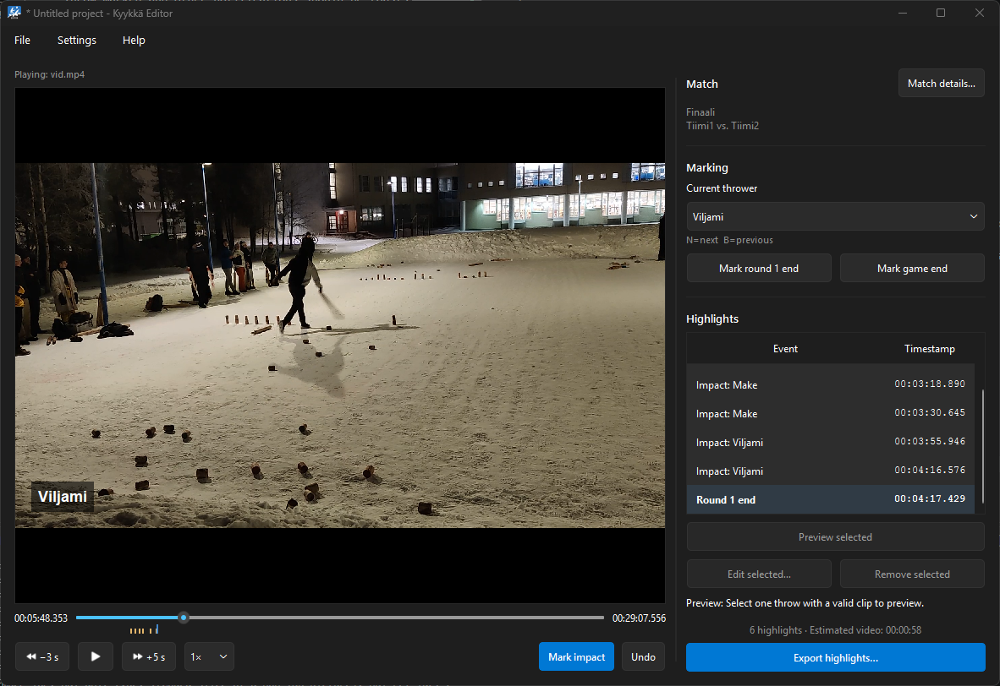
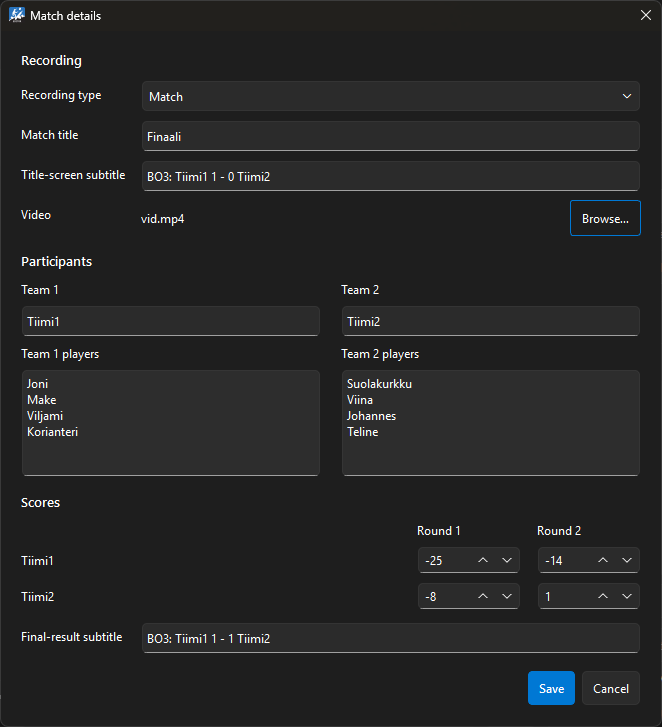
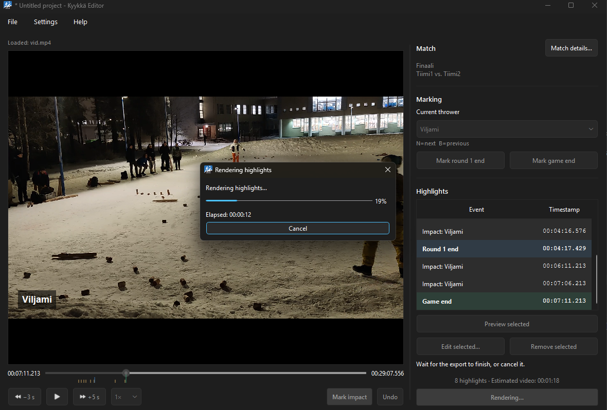

# Kyykkä Editor

A desktop application for marking impacts in a kyykkä match video and rendering
a compact highlight video around those moments. Made explicitly for editing kyykkä videos.

# Easy and fast workflow
1. Select a video file and insert match details like teams/players, title and scores
2. Skim quickly through the video with left and right arrow keys, or by clicking on the video timeline
3. Cycle through inserted players with ',' and '.' keys and mark the moment of impact for each throw with 'M' key
4. Insert round 1 and match end to their correct positions in the timeline
5. Export, view and share your freshly edited Kyykkä video!!!

## Screenshots







## Features

- Integrated video playback and scrubbing
- Visible controls for every marking action
- Keyboard shortcuts mirroring the graphical controls
- Editable throw list
- Title screen using the match title and team names
- Timeline events for the round-one result and final result/winner screens
- Optional persistent bottom-left thrower-name overlay on each marked highlight
- Live bottom-left playback overlay showing the currently selected thrower
- Match setup dialog for title, video, teams, scores, and player rosters
- FFmpeg-based highlight rendering
- Rendering dialog with an activity indicator and cancellation; cancelled exports
  clean up temporary files and preserve any existing destination video
- Live FFmpeg render percentage and elapsed time during export

## Requirements

- Python 3.11 or newer
- FFmpeg available on `PATH` for exporting videos

## Install and run

```powershell
py -m venv .venv
.\.venv\Scripts\Activate.ps1
python -m pip install -e .
kyykka-editor
```

The installed `kyykka-editor` command launches as a GUI application on Windows,
without opening a console for Qt/FFmpeg backend diagnostics. Run `python main.py`
only when those diagnostics are useful during development.

For development, install `.[dev]` and run:

```powershell
ruff format --check .
ruff check .
pytest -m "not integration"
pytest -m integration
```

Integration tests generate a small video, render a complete highlight with the
real FFmpeg executable, and inspect the result with FFprobe. They require both
programs on `PATH`. The same checks run on Windows in GitHub Actions.

## Build a distributable Windows application

Install the development dependencies and run the packaging script:

```powershell
.\venv\Scripts\Activate.ps1
python -m pip install -e ".[dev]"
.\packaging\build.ps1
```

The script discovers `ffmpeg.exe` and `ffprobe.exe` from `PATH` and creates
`dist\KyykkaEditor`. You can select a particular FFmpeg distribution instead:

```powershell
.\packaging\build.ps1 -FFmpegBin C:\ffmpeg\bin
```

Share the complete `dist\KyykkaEditor` directory, not just `KyykkaEditor.exe`.
The application uses its bundled FFmpeg tools and only falls back to `PATH` in a
development installation. Review [THIRD_PARTY_NOTICES.md](THIRD_PARTY_NOTICES.md)
before distributing the package.

Successful GitHub Actions runs for pushes to `main` and approved pull requests
targeting `main` create a downloadable Windows ZIP artifact. Open the run's
summary page and download `KyykkaEditor-windows-x64-…` from the **Artifacts**
section. CI artifacts are retained for 14 days; they are development packages,
not GitHub Releases.

CI downloads the pinned Gyan FFmpeg 9.0.1 essentials build and verifies its
published SHA-256 checksum before running integration tests or packaging it.

### Publish a release

Set `src/kyykka_editor/__init__.py` and `pyproject.toml` to the same version,
merge that change into `main`, and push a matching `v` tag:

```powershell
git tag v0.1.0
git push origin v0.1.0
```

CI verifies that the tag matches the application version, runs the complete
test/package pipeline, and publishes a GitHub Release containing
`KyykkaEditor-windows-x64.zip` with generated release notes. A mismatched tag
fails without creating a release.

## License

Kyykka Editor is free software licensed under the
[GNU General Public License, version 3 or later](LICENSE). You may use, study,
share, and modify it under the terms of that license. Distributed builds also
contain separately licensed components; see
[THIRD_PARTY_NOTICES.md](THIRD_PARTY_NOTICES.md).

## Controls

Small amber ticks below the playback slider show marked throws. They update when
throws are added, edited, or removed; slider clicking and keyboard seeking work as before.
Round-end markers are taller blue ticks; game-end markers are taller green ticks.
Hover over a marker to see its event name and timestamp.

Choose **Help → Language → Suomi** for Finnish, or **Ohje → Kieli → English**
to switch back. The interface updates immediately and remembers the selection
for the next launch. English is the default. Match titles, team/player names,
marks, and playback position are preserved when switching languages.
Exported result screens use the selected language too.

Open **Help → Hotkeys** to see all editor shortcuts.

| Action | Control | Shortcut |
| --- | --- | --- |
| Play or pause | Play/Pause | Space |
| Mark impact | Mark impact | M |
| Cycle to next thrower | Current thrower dropdown | , |
| Cycle to previous thrower | Current thrower dropdown | . |
| Undo latest mark | Undo | Ctrl+Z |
| Seek backward 3 seconds | -3 s | Left arrow |
| Seek forward 5 seconds | +5 s | Right arrow |
| Remove selected mark | Remove | Delete |
| Edit selected event | Edit selected… | E |

Primary actions are available through visible controls; shortcuts are supporting controls.
Thrower cycling follows dropdown order and wraps in either direction, including
the blank selection.

Select one timeline entry and choose **Edit selected…** (E) to correct its
timestamp or assigned thrower. End markers have a timestamp only. **Use current
playback position** copies the position at which you opened the dialog. Saving
keeps events in chronological order; Cancel leaves the entry unchanged.
Double-clicking an entry still seeks to it. Saving an edit clears the existing
mark-undo history; undoing edits is not yet supported.
Right-click a timeline entry to access Edit and Remove. Timestamp guidance is
shown only while the entered value is invalid.

In **Edit throw**, enable **Override** for Before impact and/or After impact to
set that throw's timing (0–30 seconds). Unchecked values follow the main timing
controls. Throws with overrides are labeled **custom timing** in the timeline.
Overrides apply to export and the duration estimate; the existing extra footage
for the first and last throws still applies.
